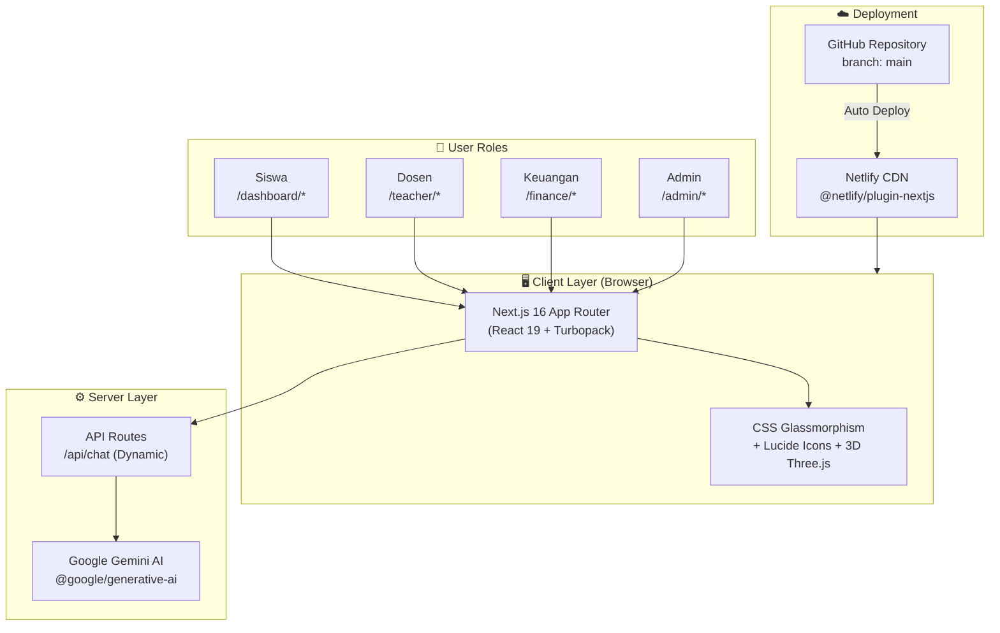
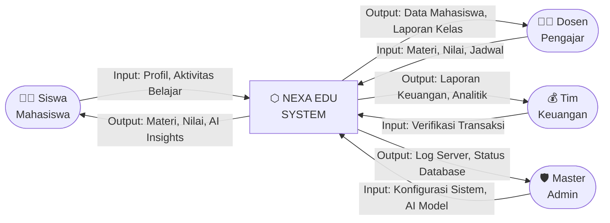
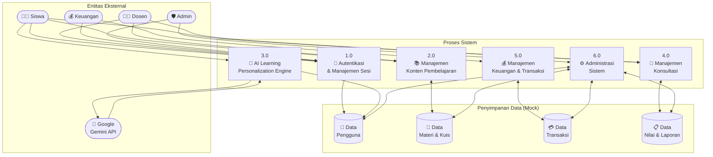
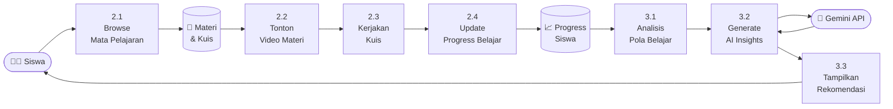
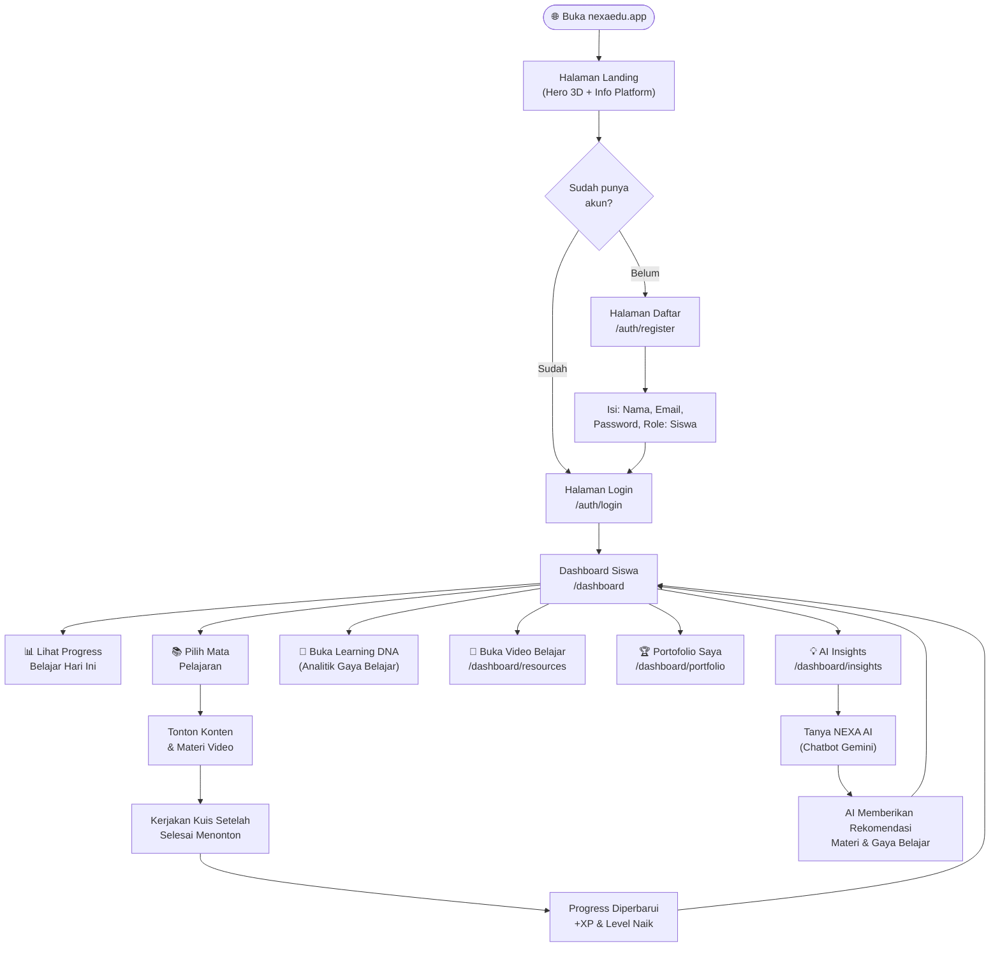
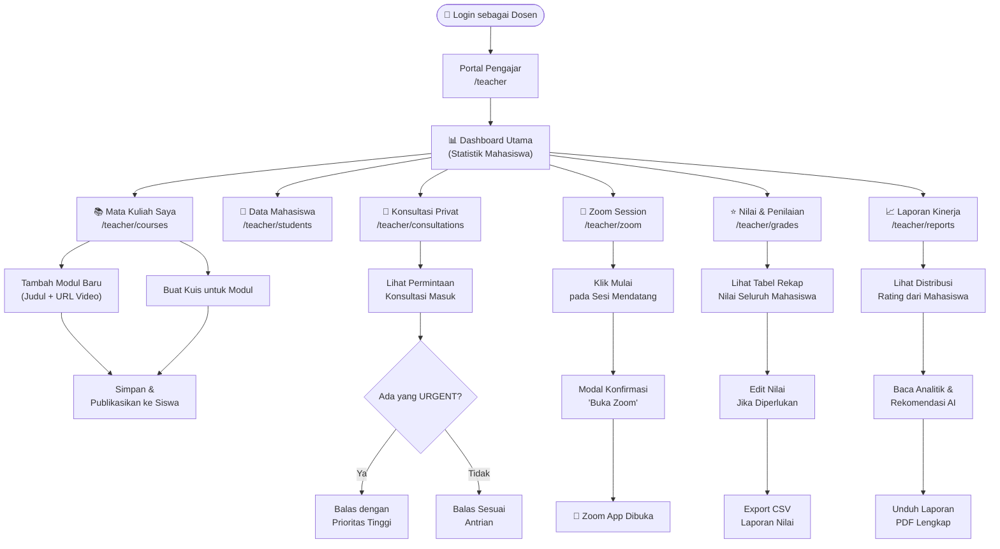
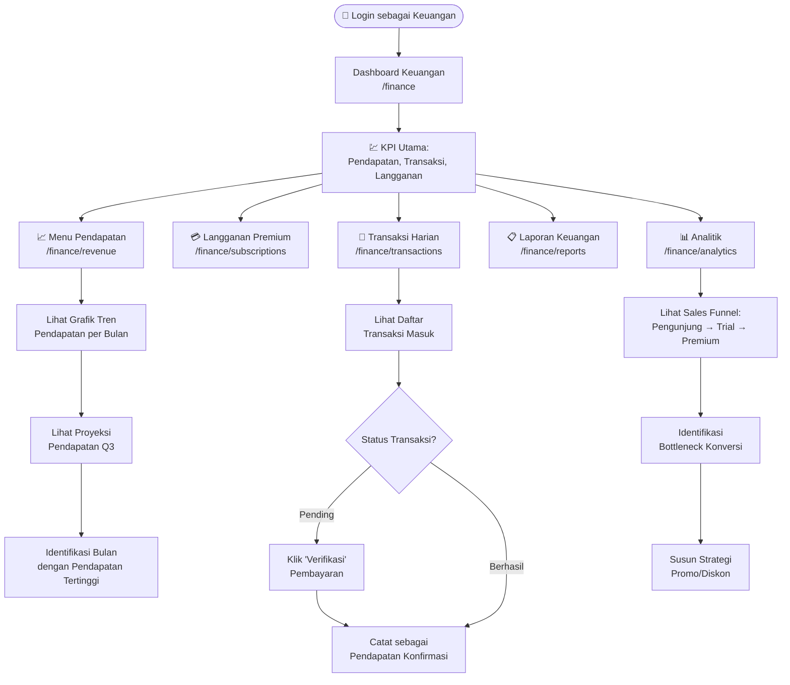
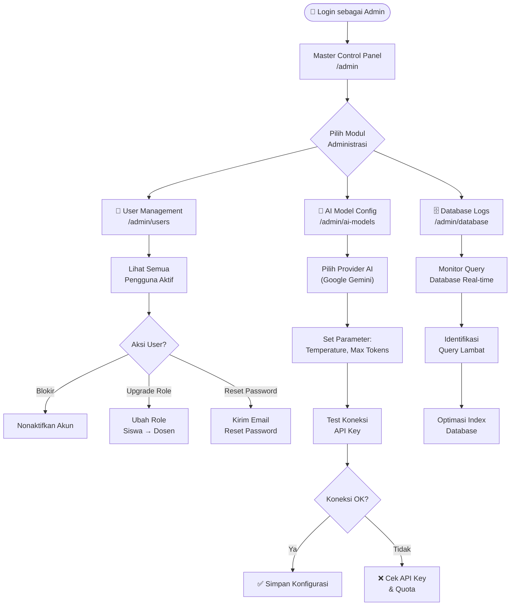
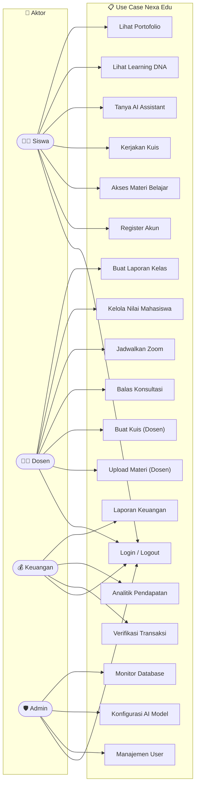

# 📘 DOKUMENTASI TEKNIS — NEXA EDU PLATFORM
### Alur Sistem, Data Flow Diagram (DFD), dan Deskripsi Fitur Lengkap

---

## 🏛️ 1. DESKRIPSI SISTEM

**Nexa Edu** adalah platform Learning Management System (LMS) generasi berikutnya yang mengintegrasikan kecerdasan buatan (AI) untuk personalisasi pembelajaran. Sistem ini memiliki **4 peran utama pengguna** dengan akses dan fitur yang berbeda-beda:

| Peran | Akses | Fungsi Utama |
|---|---|---|
| 👨‍🎓 **Siswa/Mahasiswa** | `/dashboard` | Belajar, mengakses materi, AI insights |
| 👩‍🏫 **Dosen/Pengajar** | `/teacher` | Kelola kelas, nilai, konsultasi, zoom |
| 💰 **Keuangan** | `/finance` | Pantau transaksi, pendapatan, analitik |
| 🛡️ **Master Admin** | `/admin` | Kontrol sistem, database, konfigurasi AI |

---

## 🌐 2. ARSITEKTUR SISTEM

---

## 📊 3. DFD LEVEL 0 — KONTEKS DIAGRAM

> Gambaran tertinggi: siapa saja yang berinteraksi dengan sistem dan apa yang mereka kirimkan/terima.

---

## 📊 4. DFD LEVEL 1 — PROSES UTAMA SISTEM

> Memecah sistem utama menjadi proses-proses fungsional yang saling terhubung.

---

## 📊 5. DFD LEVEL 2 — DETAIL PROSES BELAJAR SISWA (P2 & P3)

---

## 🗺️ 6. USER FLOW — ALUR LENGKAP SETIAP ROLE

### 6.1 — Flow: Siswa / Mahasiswa

---

### 6.2 — Flow: Dosen / Pengajar

---

### 6.3 — Flow: Tim Keuangan

---

### 6.4 — Flow: Master Admin

---

## 📋 7. USE CASE DIAGRAM

---

## 🗂️ 8. STRUKTUR NAVIGASI APLIKASI (Site Map)

```mermaid
graph TD
  ROOT["🌐 nexaedu.app/"]

  ROOT --> LANDING["🏠 Landing Page\n(Hero 3D, Fitur, Testimoni)"]
  ROOT --> AUTH["🔐 Autentikasi"]
  ROOT --> STUDENT["👨‍🎓 Portal Siswa\n/dashboard"]
  ROOT --> TEACHER["👩‍🏫 Portal Dosen\n/teacher"]
  ROOT --> FINANCE["💰 Portal Keuangan\n/finance"]
  ROOT --> ADMIN["🛡️ Portal Admin\n/admin"]

  AUTH --> LOGIN["/auth/login"]
  AUTH --> REG["/auth/register"]

  STUDENT --> S1["/dashboard (Beranda)"]
  STUDENT --> S2["/dashboard/dna"]
  STUDENT --> S3["/dashboard/curriculum"]
  STUDENT --> S4["/dashboard/resources"]
  STUDENT --> S5["/dashboard/virtual-class"]
  STUDENT --> S6["/dashboard/portfolio"]
  STUDENT --> S7["/dashboard/insights"]

  TEACHER --> T1["/teacher (Beranda)"]
  TEACHER --> T2["/teacher/courses"]
  TEACHER --> T3["/teacher/students"]
  TEACHER --> T4["/teacher/consultations"]
  TEACHER --> T5["/teacher/zoom"]
  TEACHER --> T6["/teacher/grades"]
  TEACHER --> T7["/teacher/reports"]

  FINANCE --> F1["/finance (Ringkasan)"]
  FINANCE --> F2["/finance/revenue"]
  FINANCE --> F3["/finance/subscriptions"]
  FINANCE --> F4["/finance/transactions"]
  FINANCE --> F5["/finance/reports"]
  FINANCE --> F6["/finance/analytics"]

  ADMIN --> A1["/admin (Overview)"]
  ADMIN --> A2["/admin/users"]
  ADMIN --> A3["/admin/ai-models"]
  ADMIN --> A4["/admin/database"]
```

---

## ⚙️ 9. TEKNOLOGI & STACK YANG DIGUNAKAN

| Kategori | Teknologi | Keterangan |
|---|---|---|
| **Framework** | Next.js 16.2.6 | App Router + Turbopack untuk performa build ultra cepat |
| **UI Library** | React 19 | Server & Client Component yang optimal |
| **3D Graphics** | Three.js + @react-three/fiber | Animasi bola & partikel 3D di Landing Page |
| **Icons** | Lucide React | Set ikon modern yang konsisten |
| **Animation** | Framer Motion + GSAP | Transisi halaman yang halus |
| **AI Integration** | Google Gemini API | Chatbot cerdas & Learning DNA |
| **Styling** | Vanilla CSS | Glassmorphism, Gradient, Dark Mode |
| **Deployment** | Netlify + GitHub | CI/CD otomatis setiap push ke main |
| **Version Control** | Git + GitHub | History & kolaborasi tim |

---

## 🎯 10. KEUNGGULAN KOMPETITIF NEXA EDU

| Fitur | Nexa Edu | Platform Biasa |
|---|---|---|
| 🧬 Learning DNA (AI) | ✅ Ada, berbasis perilaku belajar siswa | ❌ Tidak ada |
| 🌐 Animasi 3D Interaktif | ✅ WebGL Real-time di Homepage | ❌ Gambar statis |
| 📱 Mobile-First Design | ✅ Hamburger menu, Sliding sidebar | ⚠️ Perlu zoom-in |
| 👥 Multi-Role Dashboard | ✅ 4 Role (Siswa, Dosen, Finance, Admin) | ⚠️ Biasanya 2 role saja |
| 🤖 AI Chatbot Terintegrasi | ✅ Google Gemini, jawab pertanyaan | ❌ Forum manual |
| 📊 Analitik Keuangan | ✅ Sales funnel & proyeksi pendapatan | ❌ Laporan manual |
| ⚡ Kecepatan Build | ✅ Turbopack Next.js 16 | ⚠️ Build lebih lambat |
| 🔄 Auto Deploy | ✅ Netlify CI/CD dari GitHub | ❌ Upload manual |

---

*Dokumen ini dipersiapkan untuk keperluan presentasi, penilaian juri, dan evaluasi teknis platform Nexa Edu. © 2026 HANSCO — All Rights Reserved.*
